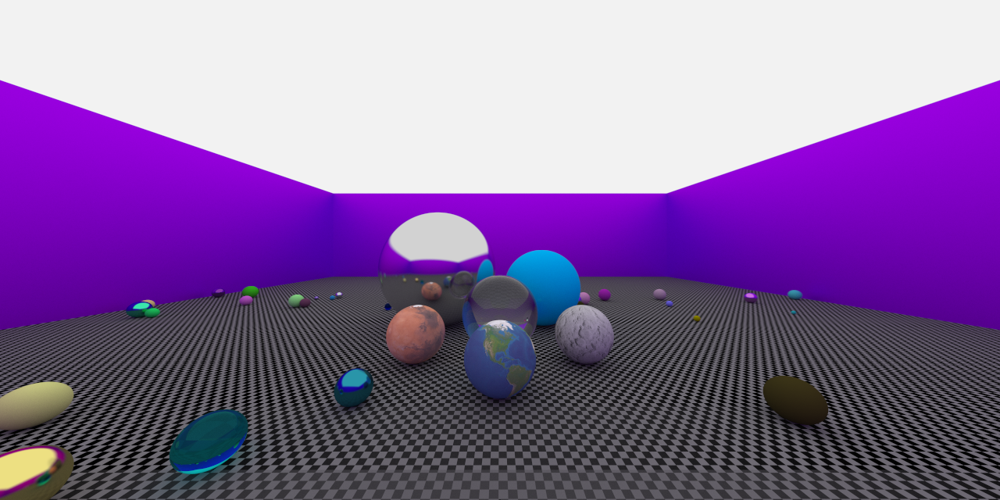

# Ray Tracing
A simple ray tracing project in c++. Many thanks to the wonder books written by Peter Shirley: [Ray Tracing in One Weekend](https://raytracing.github.io/books/RayTracingInOneWeekend.html) and [Ray Tracing: The Next Week](https://raytracing.github.io/books/RayTracingTheNextWeek.html).

## Demo
It takes several hours to render the figrue below.


## How to run the codes.
* Download `imagemagick` before converting and displaying the images.
* First, build the program by:
```
make
```
* Then, run the program by:
```
./main
```
* Once the image is generated and stored in the file `"output.ppm"`, you could conver it to png format and view it by:
```
convert output.ppm output.png
```